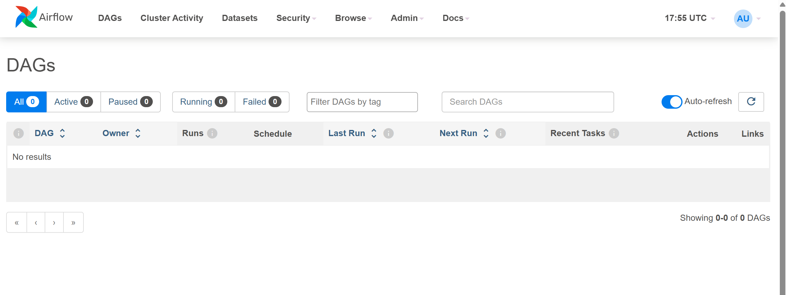
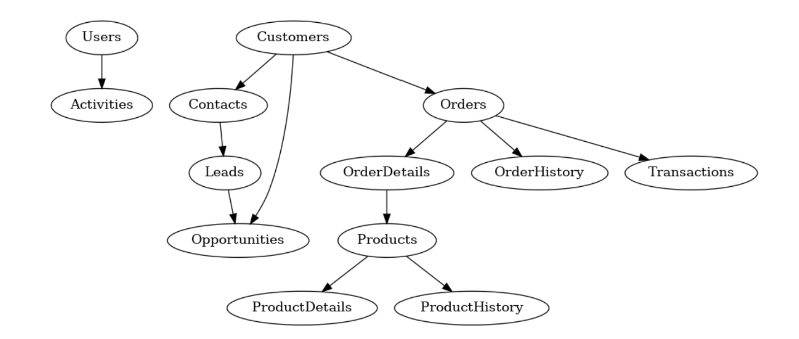
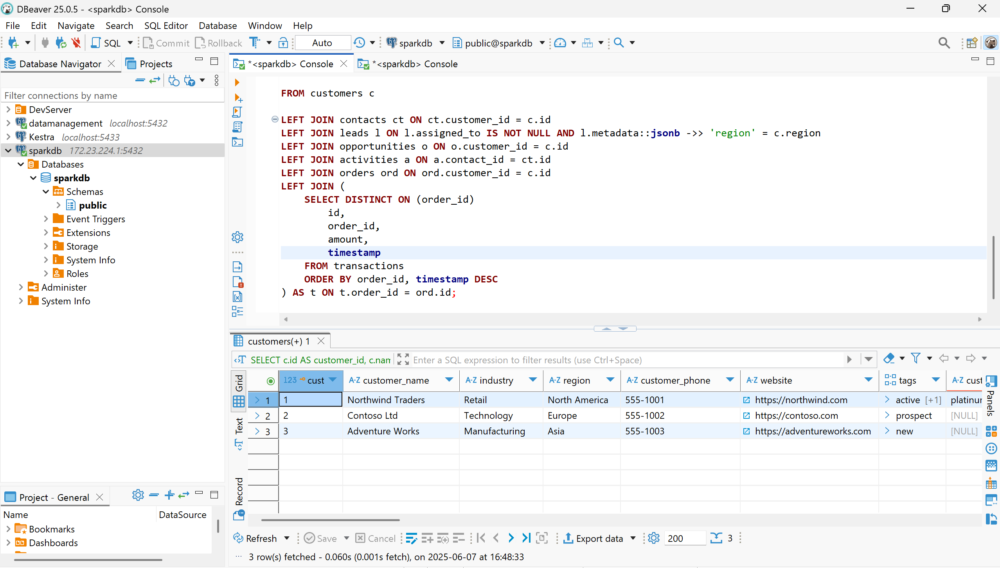
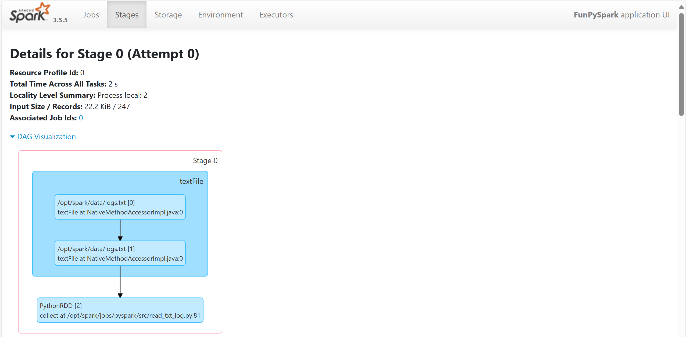

# Learn data engineering in Scala, PySpark 

  Data engineering needs complex infrastrucre setup and install huge dependencies to run a single pipeline. However, thanks to containerization, we can build similar setup for the DEV, QUA and PRD environment. This setup is test to run the Scala, Pyspark in low cost method. This repo also accept to use the ad-hoc query to run in juypter notebook.
  All the scripts and code are easy to test and run in local before submit to cloud server.  

# SYSTEM Requirement 
- GNU Linux or WSL 
- Docker must be installed 
- docke compose must be installed 
- RAM 16 GB at least 
- CPU core i5 at least 

# Languages 
- Python, PySpark 
- Scala 
- SQL 

# Framework 
- Apache Spark 
- Apache Airflow 
- Jupyter notebook / Lab for analysis

# Database 
- Postgresql 

# Using make command 

| # | command | description | 
|:-:|:-------:|:------------| 
| 1 | make build | build docker images for customized spark and jupyter | 
| 2 | make up | up all docker images and need to wait 2 to 3 mins| 
| 3 | make down | docker compose down | 
| 4 | make rebuild | rebuild the docker image | 
| 5 | make clean | clean all docker image | 
| 6 | make dev | enter the spark master | 
| 7 | make da | enter the jupyter image | 
| 8 | make pg | enter the postgresql | 
| 9 | make web | enter airflow webserver | 
|10 | make scheduler | enter aiflow scheduler | 
|11 | make redis | enter redis queue | 

# Environment file 
Remove sample from the file and edit the reqiured file such as 
user name, password etc 

| # | environment file | use file name |description | 
|:-:|:----------------:|:-------------:|:-----------:|
| 1 | sample.env | .env |  environment file for jupyter notebook and postgresql | 
| 2 | sample.env.spark | .env.spark | spark environment file | 
| 3 | sample.env.airflow | .env.airflow |airflow environment file |  

REMARK: edit and make sure the parameters before image  build and docker compose up 

# BUILD and Setup 
Run those command in GNU Linux or WSL terminal  
```shell 
make build 
make up 
```

## Check the spark master UI 
After building the docker images and up the process, check the spark UI


# Apache airflow integration 
login to the postgresql 
and use the psql command with sparkuser to create datbases and airflow 

```sql
-- Create a new database for Airflow
CREATE DATABASE airflowdb;

-- Create a new user with a secure password
CREATE USER airflow WITH PASSWORD 'airflowpass';

-- Grant privileges to the new user
GRANT ALL PRIVILEGES ON DATABASE airflowdb TO airflow;

-- change to airflowdb 
\c airflowdb

-- Grant privileges to public schema to airflow 
GRANT ALL ON SCHEMA public TO airflow;
```

## INITIAL STATE & FIRST TIME for Airflow 
```Shell 
make airflow-init-db 
make airflow-migrate 
make airflow-create-user
``` 

## Check Airflow UI 


# Load data to postgresl 
## Enter the postgresql docker image 
```
make pg 
```
## psql command to enter the postresql 
```
psql -U sparkuser -d sparkdb
```

### create schema and add data to table 


```
\i /path/to/07_dml_seed_crm_orders.sql
```
### create and insert all seed values in pg using 
Remark: init.sh is in the sql_scripts folder
```
./init.sh 
```

# Check the defautl route to interactive with DBeaver 
```
ip route | grep default 
```
The Sample output is -> default via 172.23.224.1 dev eth0 proto kernel 

# PG connection and check for single view
- Add the requried data to connection and use the default IP addess get from the ip route, in this case the jdbc connecting is using 172.23.224.1 this ip address



# Spark submit 
###  Build the jar file 
using make dev and do the following steps 
```
cd /opt/spark/jobs/scala
sbt package 
```
if the required jar files are not created. 

### output jar location 
The path contains the output of sbt compiler 
```
/opt/spark/jobs/scala/target/scala-2.12
```

### Jar file submit 
    This process needs to do in the master node and run this command 
```
/opt/spark/bin
```
Then run the spark-submit to get the result
```
spark-submit \
  --class readTxtLog \
  --master spark://spark-master:7077 \
  --conf spark.input.path=/opt/spark/data/logs.txt \
  --conf spark.log.type=INFO \
  --conf spark.interface.name=VTLINK \
  /opt/spark/jobs/scala/target/scala-2.12/sparkrdd_2.12-0.1.jar
```
### Pyspark submit
For test with PySpark 
```
PYSPARK_DRIVER_PYTHON=python3 spark-submit \
  --master spark://spark-master:7077 \
  --conf spark.input.path=/opt/spark/data/logs.txt \
  --conf spark.log.type=INFO \
  --conf spark.interface.name=VTLINK \
  /opt/spark/jobs/pyspark/src/read_txt_log.py
```

# check the process in UI
we can check the spark process in UI and it is also a dag.  




# Business values 
- Same report for OLD CRM system is monolithic and some are running in Mirco service 
- Real time data analysis support
- Data As A Product 
- Compliant checking using AI
- report generation in pdf and in excel 
- ON DEMANd ad-hoc report supprot 
- Master data management 

# Next plan 
- Full ETL pipeline in Scala 
- DataVault 2.0 and SCD type 2 for address and historical tracking 
- CI/CD 
- Data profiler 
- Integration with DBT 
- Integration with Apache Iceberg and Delta lake 
- integration with Aapche Kafka
